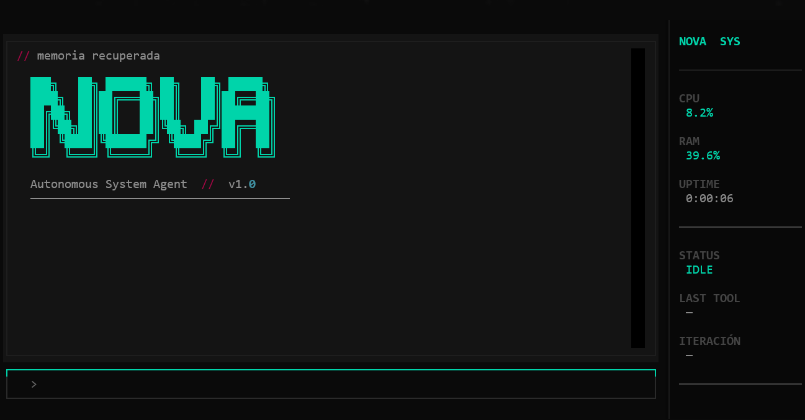

# Nova Agent: Your Autonomous Local Intelligence

Nova Agent is a powerful, autonomous AI agent designed to run locally, leveraging Google's Gemini models to assist with complex tasks, system interaction, and intelligent decision-making. Built with a modular architecture, it combines the power of LangChain, Pydantic, and Textual for a seamless terminal-based experience.



## Features
- **Advanced TUI Interface:** Built with `Textual`, it offers real-time monitoring of CPU, RAM, and system uptime.
- **Dynamic Brain:** Hot-swapping configuration of the model (Gemini 1.5 Flash, 1.5 Pro, etc.) and persistent session management.
- **Integrated Toolbox:**
   - **Files:** List, read, write, delete, and explore complete project structures (`explore_project`).
   - **Web:** Real-time technical searches using SerpApi.
   - **System:** Execution of PowerShell commands for local diagnostics.
- **Security by Design:** Authorization system using modals (`SecurityModal`) for critical actions such as deleting files or executing commands.
- **Zero-Setup Configuration:** Automatic welcome interface to configure API keys without needing to manually edit `.env` files.

---

## Installation

Nova is professionally packaged with Poetry.

### For Users (Via PyPI / Wheel)
If you already have the `.whl` package or it's published on PyPI:
```bash
pip install nova-agent
nova
```

### For Developers

#### 1. Clone and CD:
```bash
git clone [https://github.com/juliannp253/Nova-agent](https://github.com/your-user/nova-agent.git)
cd nova-agent
```
#### 2. Install dependencies with Poetry:
```bash
poetry install
```
#### 3. Execute on development mode:
```bash
poetry run nova
```
---
## Initial Configuration
When you run Nova for the first time, the system will detect the absence of credentials and automatically open the Key Management Portal.

1. Google AI Studio Key: Required for agent reasoning.
2. SerpApi Key: Optional, required for the agent to search Google.
3. Model Selection: You can specify which model from the Gemini family you want to use.
   - You can reopen this menu at any time by pressing Ctrl + K within the application.

---

## Technical Architecture
Nova is divided into four fundamental pillars that guarantee its scalability:

- Brain (`brain.py`): LLM management, message history, and dynamic tool linking.
- UI (`ui.py`): Thread management (`Workers`) to avoid blocking the interface and rendering of TUI components.
- Execution (`executor.py`): Intermediate layer that maps AI calls to executable Python functions. 
- Settings (`settings.py`): Persistence of global configuration in `~/.nova/config.json`.

---

## Operational Safety

Nova implements a "Human Approval" protocol. Whenever the AI ​​attempts to perform an action that could affect the integrity of your system (such as `run_command` or `delete_file`), an authorization modal will be displayed showing the exact arguments.

---

## License

This project is under the MIT license, which allows its free use, copying, and modification.

Developed by Julian Padron – Software Engineer (Backend)

